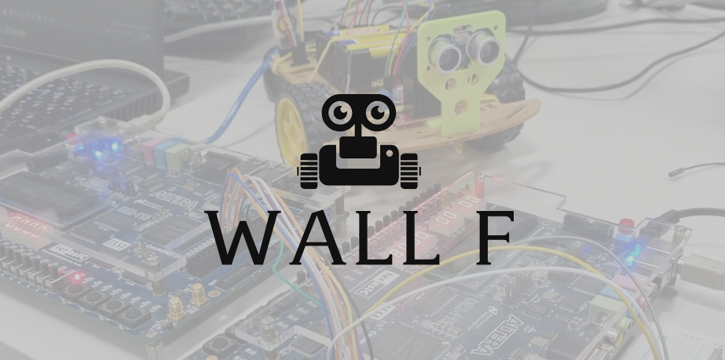
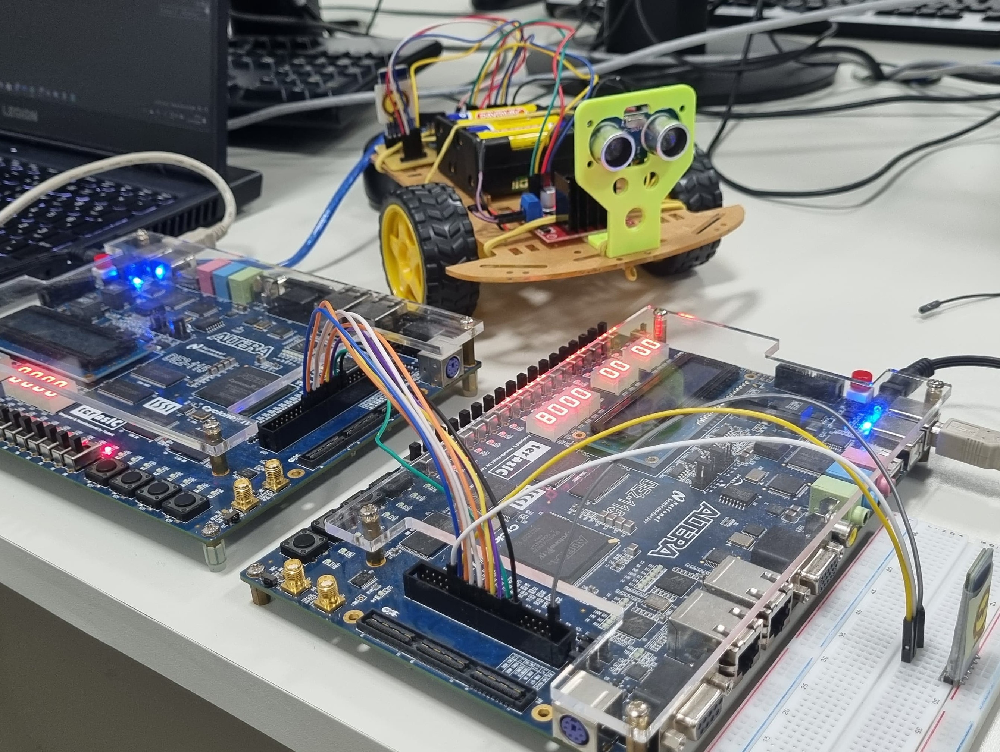
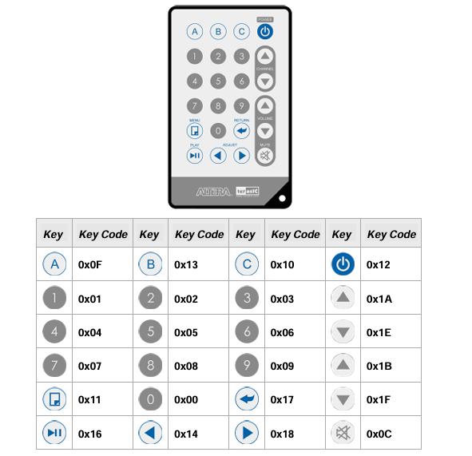
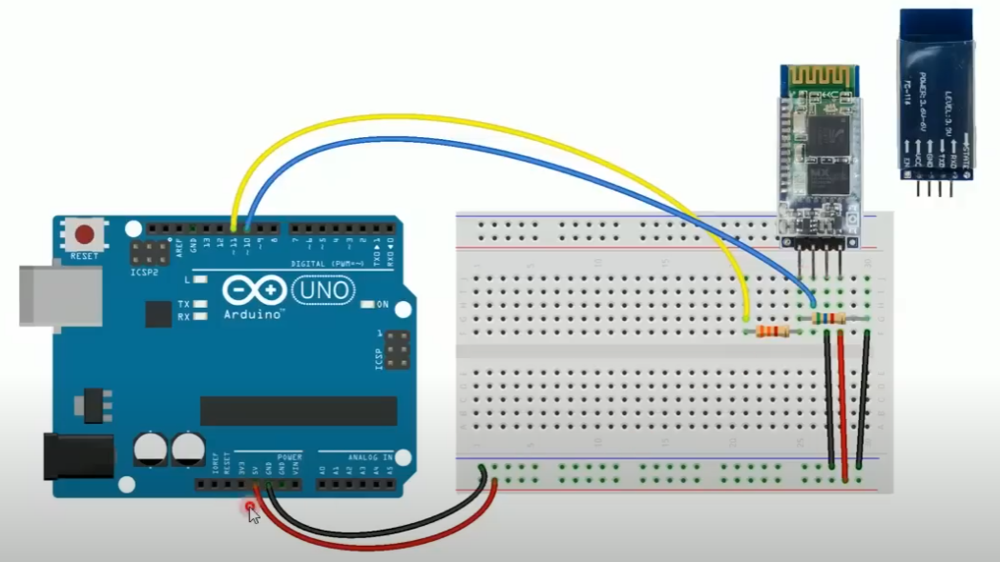
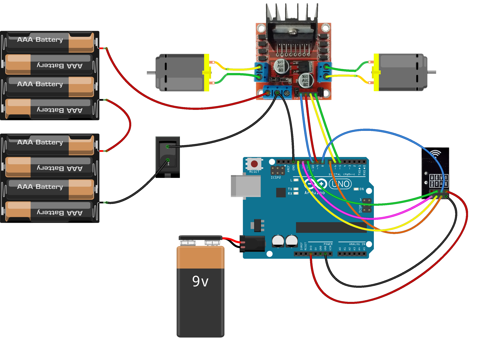
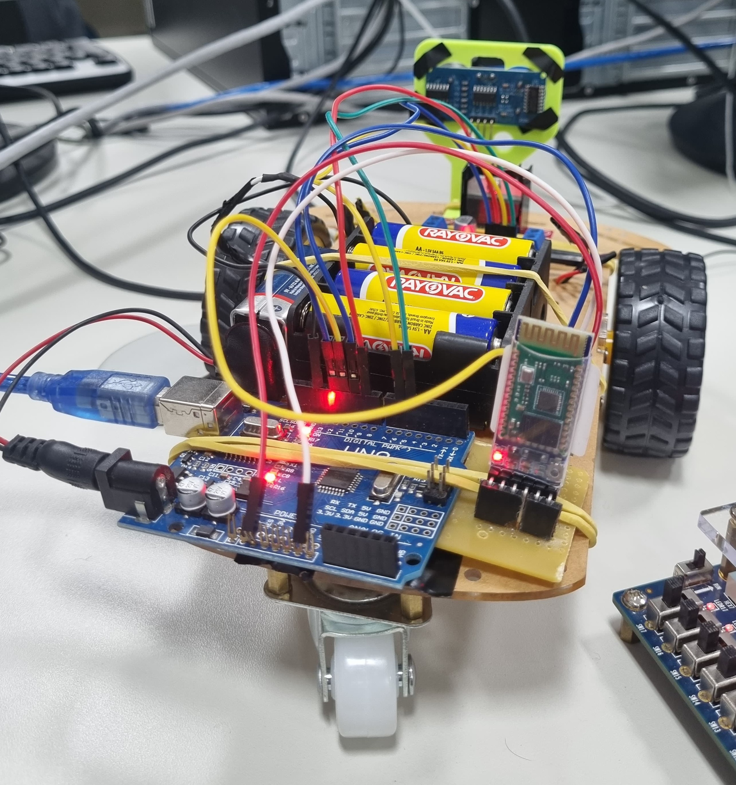

## 📡 Sistema de Comunicação Digital para o Robô WALL-F

#### 📖 Descrição

Este projeto implementa um **sistema de comunicação digital** que permite controlar remotamente o robô **WALL-F**, um robô baseado em **Arduino UNO**, usando tecnologias de **FPGA**, **controle remoto infravermelho (IR)**, **comunicação paralela via GPIO**, **protocolo UART** e **Bluetooth HC-05**.

O objetivo principal é demonstrar, na prática, a **integração de diferentes tecnologias de comunicação digital** — cabeadas e sem fio — usando conceitos de sistemas embarcados, protocolos de comunicação serial e automação.

Este sistema foi desenvolvido **adaptando e expandindo os processadores** criados anteriormente em laboratórios anteriores. Para entender o funcionamento completo da base dos processadores originais, consulte:

- [`processor.v`](https://github.com/gabrielaverza/MIPS-Processor-and-OS)
- [`sistemacomputacional.v`](https://github.com/MaBe-Computer-System)

O robô já foi utilizado anteriormente na disciplina de Sistemas Embarcados, onde contava com sensores e uma integração entre o Arduino e a placa PIC.

O projeto pode ser encontrado em:
- [`WALL-F`](https://github.com/fernandabucheri/WALL-F)

---

#### 🎯 Objetivos

**Objetivo Geral**  
- Integrar dois sistemas operacionais independentes, implementados em **FPGAs Altera DE2-115**, com o propósito de controlar um robô físico via **Bluetooth**, recebendo comandos de um controle remoto **infravermelho**.

**Objetivos Específicos**
- Captar sinais de um controle remoto infravermelho.
- Decodificar o sinal em uma FPGA.
- Transmitir o comando para outra FPGA via GPIO.
- Enviar o comando decodificado para um módulo Bluetooth via UART.
- Receber o comando no Arduino e executar a ação no robô.

---

#### ⚙️ Tecnologias Utilizadas

- **FPGAs (Altera DE2-115)**
- **Controle Remoto Infravermelho**
- **Comunicação GPIO**
- **Protocolo UART**
- **Módulo Bluetooth HC-05**
- **Plataforma Arduino UNO**

---

#### 🔗 Fluxo do Sistema

```plaintext
Controle IR → FPGA 1 (IR_RECEIVER) → GPIO → FPGA 2 (UART_TX) → Bluetooth HC-05 → Robô Arduino (WALL-F)
````

---

#### 📸 Visão Geral do Projeto



---

#### 🎮 Controle Remoto IR

O sistema utiliza um controle remoto infravermelho do kit FPGA para enviar os comandos ao robô. Cada botão emite um **Key Code**, que é decodificado na FPGA.



---

#### ⚙️ Conexões Físicas

#### 🔌 Esquemático de Conexão do Módulo Bluetooth HC-05

O módulo **Bluetooth HC-05** é conectado ao Arduino para receber comandos serialmente. Para essa montagem, nos baseamos no vídeo do canal **[Brincando com Ideias](https://www.youtube.com/watch?v=Zl3IvfNaafA&t=214s)** 




#### 🛠️ Montagem do Robô

O diagrama abaixo mostra como são feitas as ligações físicas do robô, incluindo motores, ponte H, baterias e a placa Arduino. Para montar essa parte, também usamos como referência o vídeo do canal **[Brincando com Ideias](https://www.youtube.com/watch?v=ZAKyxNs2uuA)** 



---

#### 📸 Montagem Real

Foto do robô **WALL-F** com todas as conexões físicas montadas, demonstrando a integração entre Arduino, ponte H, motores e alimentação.



---

#### 🗂️ Principais Máquinas de Estado

**📡 Receptor Infravermelho (IR\_RECEIVER)**

* **IDLE**: Monitora continuamente o sinal IR aguardando o pulso inicial (Lead Code).
* **GUIDANCE**: Verifica se o Lead Code segue o padrão NEC, sincronizando a leitura dos bits.
* **DATAREAD**: Lê os 32 bits (Custom Code, Key Code, Inversed Key Code). Verifica integridade e sinaliza quando os dados estão prontos.
* **FINALIZAÇÃO**: Retorna ao estado IDLE após confirmar a integridade dos dados.

**🔗 Transmissor UART (UART\_TX)**

* **IDLE**: Linha de transmissão em nível alto.
* **START\_BIT**: Linha vai a nível baixo para iniciar transmissão.
* **DATA\_BITS**: Transmite os 8 bits do dado, um por vez, sincronizados pelo clock.
* **STOP\_BIT**: Finaliza transmissão com bit de parada e retorna ao IDLE.

---

#### 🎮 Mapeamento de Comandos

| Botão IR   | Ação no Robô          |
| ---------- | --------------------- |
| 1          | Andar para frente     |
| 2          | Andar para trás       |
| 3          | Virar à esquerda      |
| 4          | Virar à direita       |
| 5          | Girar no próprio eixo |
| 0 / Outros | Parar                 |

---

#### ✅ Resultados

* Reconhecimento preciso dos sinais IR na primeira FPGA.
* Comunicação paralela estável entre as FPGAs via GPIO.
* Transmissão UART confiável para o módulo Bluetooth.
* Comunicação Bluetooth robusta (alcance de até **10 metros**).
* Resposta do robô inferior a **1 segundo** para cada comando.

<br>


